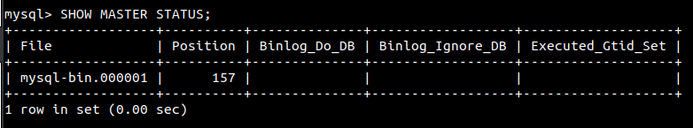
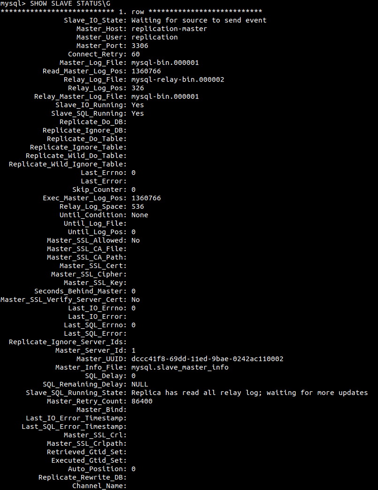
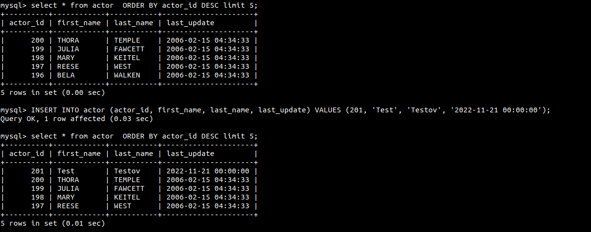
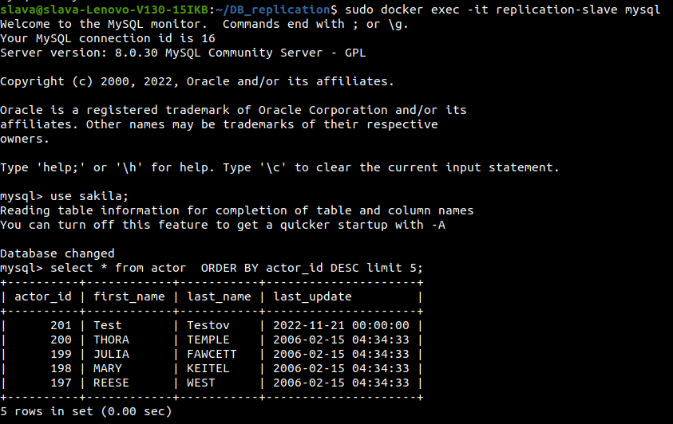

# Домашнее задание к занятию 12.6 "Репликация и масштабирование. Часть 1"
Домашнее задание выполните в Google Docs и отправьте в личном кабинете на проверку ссылку на ваш документ.

Название файла должно содержать номер лекции и фамилию студента. Пример названия: "12.6 "Репликация и масштабирование. Часть 1 - Александр Александров"

Перед тем как выслать ссылку, убедитесь, что ее содержимое не является приватным (открыто на просмотр всем, у кого есть ссылка). Если необходимо прикрепить дополнительные ссылки, просто добавьте их в свой Google Docs.

Любые вопросы по решению задач задавайте в чате учебной группы.

---

### Задание 1.

На лекции рассматривались режимы репликации master-slave, master-master, опишите их различия.

```
master-slave

Master - основной сервер, накоторый производится запись и может производиться чтение.
Slave - вспомогательный сервер, который копирует данные с master. Обычно используется для чтения данных.

master-master

Оба сервера равноценны и копирование может происходить с одного на другой в обе стороны.

Отличие в том, что при master-slave запись только на master, а при master-master запись может быть на оба сервера.
```

---

### Задание 2.

Выполните конфигурацию Master-Slave репликации (примером можно пользоваться из лекции).

*Приложите скриншоты конфигурации, выполнения работы (состояния и режимы работы серверов).*
```bash
# использовал базу из предыдущих занятий sakila
# создал контейнеры master, slave
sudo docker run -d --name replication-master -e MYSQL_ALLOW_EMPTY_PASSWORD=true -v ~/DB_replication:docker-entrypoint-initdb.d mysql:8.0
sudo docker run -d --name replication-slave -e MYSQL_ALLOW_EMPTY_PASSWORD=true mysql:8.0

# настроил сеть
sudo docker network create replication
sudo docker network connect replication replication-master
sudo docker network connect replication replication-slave

# установил nano в докерах. Т.к. mysql установлен в докере на основе урезанной fedora, использовал менеджер пакетов microdnf (apt, yum там нет)
sudo docker exec replication-master microdnf nano
sudo docker exec replication-slave microdnf nano

# создал учетку для репликации на мастере
sudo docker exec -it replication-master mysql
mysql> CREATE USER 'replication'@'%';
mysql> GRANT REPLICATION SLAVE ON *.* TO 'replication'@'%';

# прописал настройки в конфиг мастера
sudo docker exec -it replication-master nano /etc/my.cnf

server_id = 1
log_bin = mysql-bin

# перезагрузил мастер
sudo docker restart replication-master

# проверил состояние
sudo docker exec -it replication-master mysql
mysql> SHOW MASTER STATUS;

# сдампил базу
mysql> FLUSH TABLES WITH READ LOCK;
sudo docker exec replication-master mysqldump sakila > ~/DB_replication/sakila.sql

# запомнил File и Position
sudo docker exec -it replication-master mysql
mysql> SHOW MASTER STATUS;
```


```bash
# разлочил таблицы
mysql> UNLOCK TABLES;

# скопировал дамп на докер slave
sudo docker cp sakila.sql replication-slave:/tmp/sakila.sql

# залил дамп БД на slave
sudo docker exec -it replication-slave mysql
mysql> CREATE DATABASE `sakila`;
sudo docker exec -it replication-slave bash
mysql sakila < /tmp/sakila.sql

# прописал настройки на slave
log_bin = mysql-bin
server_id = 2
relay-log = /var/lib/mysql/mysql-relay-bin
relay-log-index = /var/lib/mysql/mysql-relay-bin.index
read_only = 1

sudo docker restart replication-slave

# прописал File и Position на slave
mysql> CHANGE MASTER TO MASTER_HOST='replication-master',
MASTER_USER='replication', MASTER_LOG_FILE='mysql-bin.000001',
MASTER_LOG_POS=156;

# запустил slave
mysql> START SLAVE;
mysql> SHOW SLAVE STATUS\G
```


```bash
# Для проверки добавил строку 201 в таблицу actor на мастере
```


```
# проверил на слэйве
```

```
---

## Дополнительные задания (со звездочкой*)

Эти задания дополнительные (не обязательные к выполнению) и никак не повлияют на получение вами зачета по этому домашнему заданию. Вы можете их выполнить, если хотите глубже и/или шире разобраться в материале.

---

### Задание 3*. 

Выполните конфигурацию Master-Master репликации. Произведите проверку.

*Приложите скриншоты конфигурации, выполнения работы (состояния и режимы работы серверов).*
